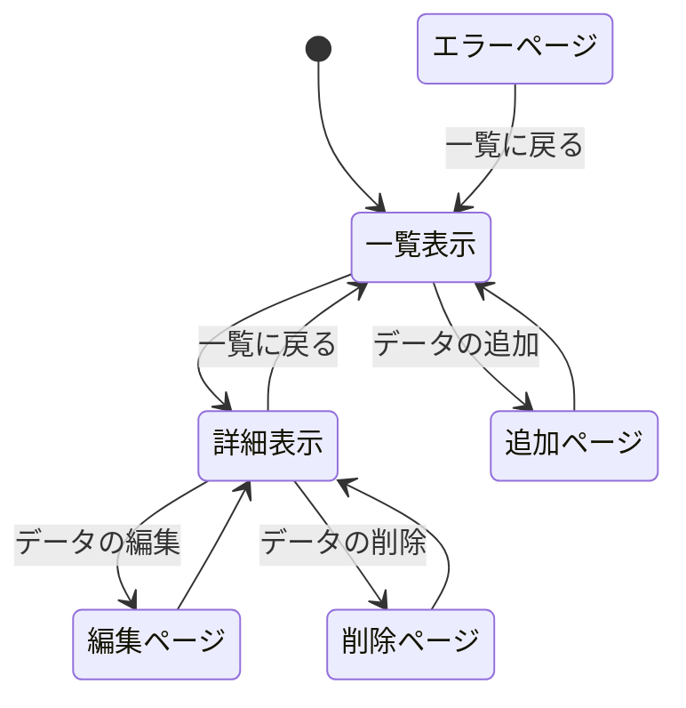
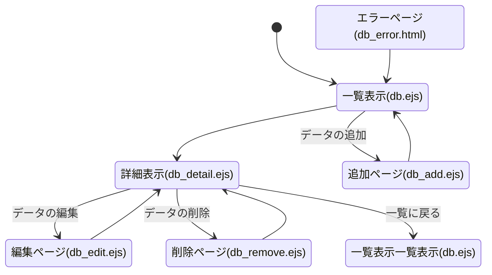

# 仕様

### テーマ
1. アークナイツ
1. マイクラ
1. 曲

### ページ遷移図

```mermaid
stateDiagram-v2
    [*] --> 一覧表示
    エラーページ --> 一覧表示:一覧に戻る
    一覧表示 --> 詳細表示
    一覧表示　--> 追加ページ:データの追加
    追加ページ --> 一覧表示

    詳細表示 --> 編集ページ:データの編集
    詳細表示 --> 削除ページ:データの削除
    詳細表示 --> 一覧表示:一覧に戻る

    編集ページ --> 詳細表示
    削除ページ --> 詳細表示
```

### ページ遷移図

```mermaid
stateDiagram-v2
    [*] --> 一覧表示(db.ejs)
    一覧表示(db.ejs) --> 詳細表示(db_detail.ejs)
    一覧表示(db.ejs)　--> 追加ページ(db_add.ejs):データの追加
    追加ページ(db_add.ejs) --> 一覧表示(db.ejs)

    詳細表示(db_detail.ejs) --> 編集ページ(db_edit.ejs):データの編集
    詳細表示(db_detail.ejs) --> 削除ページ(db_remove.ejs):データの削除
    詳細表示(db_detail.ejs) --> 一覧表示一覧表示(db.ejs):一覧に戻る

    編集ページ(db_edit.ejs) --> 詳細表示(db_detail.ejs)
    削除ページ(db_remove.ejs) --> 詳細表示(db_detail.ejs)

    エラーページ(db_error.html) --> 一覧表示(db.ejs)
```

### 各テーマごとのデータ構造
